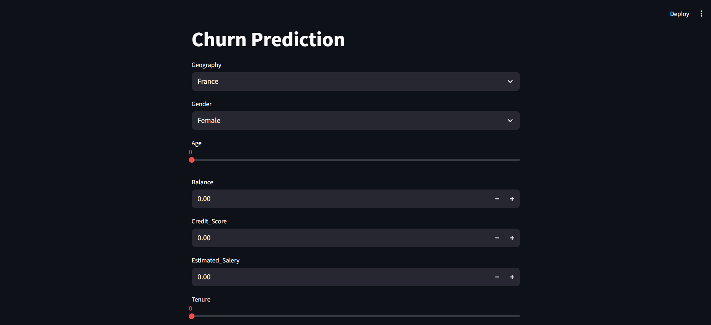
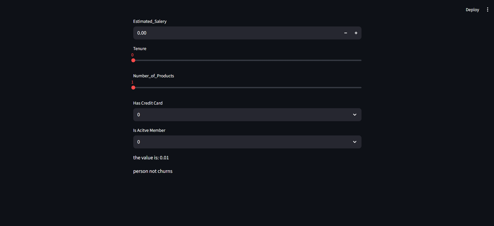

# Customer Churn Prediction using ANN

## 📌 Project Overview  
This project predicts **customer churn** using an Artificial Neural Network (ANN).  
The dataset used is **Churn_Modelling.csv**, where various customer attributes are analyzed to predict whether a customer is likely to leave the service.  

The workflow includes:  
- Data preprocessing (encoding categorical features, scaling numerical features).  
- Training an **ANN model** using TensorFlow/Keras.  
- Saving trained model & preprocessing objects (`.h5` and `.pkl` files).  
- A prediction app (`app.py`) to take new customer input and predict churn.  

---

## 🛠️ Tech Stack  
- **Python 3**  
- **TensorFlow / Keras**  
- **Pandas, NumPy, Scikit-Learn**  
- **Flask / Streamlit (for app interface)**  
- **Pickle (for saving encoders/scaler)**  

---

## 📂 Project Structure  
├── screenshots
│   ├── tensorboard_accuracy.png
│   └── tensorboard_loss.png
├── experiment.ipynb # Data preprocessing & ANN model training
├── prediction.ipynb # Loading model & testing predictions
├── app.py # Web app for user input & prediction
├── model.h5 # Trained ANN model
├── label_encoder_gender.pkl # Label encoder for Gender
├── onehot_encoder_geography.pkl # One-hot encoder for Geography
├── scaler.pkl # Standard scaler for features
├── Churn_Modelling.csv # Dataset
└── README.md # Project documentation


## 📸 Screenshots  

### Churn Prediction Webapp  
  

### 
  


---

## 🚀 How to Run  

### 1️⃣ Clone the Repository  
```bash
git clone https://github.com/ItsMeVenom-Dev/ANN_Classification.git
cd ANN_Classification
```

### 2️⃣ Install Dependencies
```
pip install -r requirements.txt
```

### 3️⃣ Run Prediction App
```
python app.py
```


📝 License
This project is licensed under the Apache License 2.0
